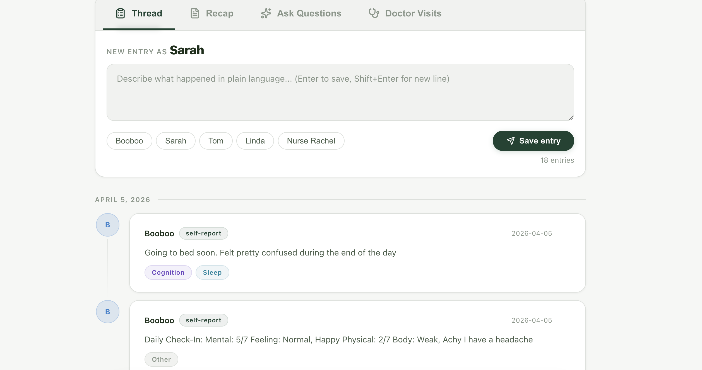

# CareLog: Multi-Perspective Care Tracking for Dementia Patients



## The Problem

Dementia patients often give **confident but inaccurate answers** to medical questions. When a doctor asks "Have you fallen this week?" or "Have you been confused?", a patient with memory issues may genuinely believe they're fine — even when caregivers have observed otherwise.

Family members who try to correct the record in the room face an uncomfortable social dynamic: it looks like they're speaking over their loved one or being controlling. The patient feels embarrassed. The doctor gets an incomplete picture.

**CareLog solves this by creating a verified, multi-perspective record** that captures how different people — the patient, family members, nurses, and aides — each experience and report the same events.

## How It Works

CareLog is a full-stack web application (FastAPI + React) powered by Claude (Anthropic's AI) with a RAG pipeline backed by ChromaDB.

### Natural Language Logging
Caregivers describe what happened in plain language. No forms, no dropdowns. Claude automatically parses entries into structured categories (mood, cognition, medication, meals, sleep, incidents, etc.) and extracts the correct date — even from entries like "last Tuesday Dad had a fall."

### Multi-Perspective Capture
Each entry is tagged with who reported it and when. The patient's own self-reports are recorded alongside family and professional observations — without overwriting or contradicting anyone.

### Patient Journal
The patient gets their own private space to record how they're feeling in their own words. Journal visibility is controlled by the patient — they can choose to share entries with their care circle or keep them private.

### RAG-Powered Q&A
When a user asks a question, semantically relevant entries are retrieved from a ChromaDB vector store — not the entire log. Only those entries are passed to Claude for synthesis, enabling the system to scale beyond context window limits.

### Doctor Visit Summaries
Generate structured briefings for doctor appointments that highlight patterns and discrepancies across reporters. Summaries are available in two lengths: a quick paragraph for a busy appointment or a detailed section-by-section briefing.

### Doctor Visit Processing
After an appointment, paste in your notes or transcript. Claude extracts the doctor's name, date, key takeaways, and medication changes — building a searchable history of visits over time.

## Why This Matters

The core insight: **the gap between a patient's self-report and caregiver observations is clinically valuable information.** CareLog captures that gap without requiring anyone to contradict the patient in person.

A doctor using CareLog before an appointment can see:
- The patient reported "feeling fine, everything normal"
- Their spouse documented confusion episodes and missed medication that same day
- A nurse independently confirmed memory problems

This changes the quality of a 15-minute appointment dramatically.

## Design Principles

- **Dignity-first**: The patient is a participant, not a subject. Their perspective is recorded and valued, not overridden. They control their own journal privacy.
- **No wrong answers**: Conflicting reports aren't errors — they're data. The system presents all perspectives without picking sides.
- **Effortless input**: If it's harder than sending a text message, caregivers won't use it. Natural language input removes all friction.

## Tech Stack

- **Backend**: FastAPI (Python) with Anthropic Claude API
- **Frontend**: React 19 with Vite
- **Database**: PostgreSQL via SQLAlchemy (SQLite for local dev)
- **Auth**: JWT-based authentication with role-based access (admin, caregiver, patient)
- **RAG**: ChromaDB vector database for semantic search over care entries

## Architecture

```
React Frontend (Vite)
    |
    v
FastAPI Backend (JWT auth, role-based access)
    |
    ├── Claude API (parse entries, generate summaries, answer questions, process visits)
    |
    ├── SQLAlchemy + SQLite/Postgres (entries, users, care circles, visits, changelog)
    |
    ├── ChromaDB Vector Store (semantic embeddings for RAG retrieval)
    |       |
    |       └── On query: semantic search → retrieve relevant entries → Claude synthesis
    |
    └── Auth (JWT tokens, role-based access, care circle scoping)
```

**Dual storage strategy**: Entries are stored relationally (SQL) for CRUD, filtering, and access control. They are simultaneously indexed in ChromaDB as vector embeddings. The Ask feature queries ChromaDB for semantically relevant entries, applies privacy filtering against SQL, then passes only the relevant subset to Claude — not the entire log.

### Care Circle Model

Each deployment centers around a **care circle** — one patient and the people who care for them. Users have roles:

| Role | Can do |
|------|--------|
| **Patient** | Log entries, write private journal, control journal visibility, view summaries |
| **Caregiver** | Log entries, view all entries, generate summaries, ask questions, record visits |
| **Admin** | All of the above + manage users, view changelog, delete entries |

## Setup

### Prerequisites
- Python 3.9+
- Node.js 20+
- An Anthropic API key ([get one here](https://console.anthropic.com))

### Installation

```bash
git clone https://github.com/jtmcc17-boop/carelog.git
cd carelog
pip install -r requirements.txt
export ANTHROPIC_API_KEY="your-api-key"

# Frontend
cd frontend
npm install
```

### Seed the database

```bash
python3 seed.py
```

This creates two care circles with demo data:
- **Family circle (Mark)**: `admin` / `admin123`
- **Demo circle (Booboo)**: `demo_admin` / `demo123`, plus family members (`demo_tom`, `demo_linda`, `demo_nurse` — all `demo123`) and patient (`demo_booboo` / `baseball`)

### Run

**Backend:**
```bash
python3 -m uvicorn api:app --reload
```

**Frontend:**
```bash
cd frontend
npm run dev
```

### Index existing entries into ChromaDB

After seeding (or if you have existing SQL data), rebuild the RAG index by calling:

```bash
curl -X POST http://localhost:8000/api/admin/rebuild-rag \
  -H "Authorization: Bearer <your-admin-jwt>"
```

New entries are automatically indexed on creation.

## API Endpoints

| Endpoint | Method | Description |
|----------|--------|-------------|
| `/api/auth/login` | POST | Authenticate and receive JWT |
| `/api/auth/me` | GET | Current user info |
| `/api/entries` | GET | List entries for your care circle |
| `/api/entries` | POST | Log a new entry (auto-parsed by AI, indexed in ChromaDB) |
| `/api/entries/{id}` | DELETE | Soft-delete an entry (admin only) |
| `/api/ask` | POST | Ask a question — uses RAG semantic search |
| `/api/summary` | POST | Generate a doctor visit summary |
| `/api/visits` | GET/POST | List or save doctor visits |
| `/api/visits/process` | POST | AI-process a visit transcript |
| `/api/admin/users` | GET/POST | List or create users (admin only) |
| `/api/admin/users/{id}` | PATCH/DELETE | Update or deactivate users (admin only) |
| `/api/admin/changelog` | GET | View audit log (admin only) |
| `/api/admin/rebuild-rag` | POST | Re-index all entries into ChromaDB (admin only) |

## Background

This project was born from personal experience caring for a family member with dementia. The core problem — that patients can be confidently wrong about their own condition, and the social dynamics of caregiving make it hard for family to correct the record — is one that existing tools don't address.

Built as part of a 90-day AI Product Management development plan, focusing on the Anthropic SDK, RAG pipelines, and practical AI applications for underserved users.

## License

MIT
